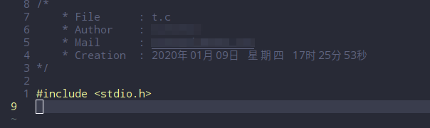

# NewFileTitle

> Add title to a new file for vim plug

## installation

* Install with the `vim-plug` tool : 

  ```vim
  call plug#begin('~/.vim/plugged')
  Plug 'sunowsir/NewFileTitle'  
  call plug#end()
  ```

## Setup

* Set some languages you need to support : 

  > The currently supported languages are:  c、c++、go、shell、python、lua、vimscript.
  >
  > All default supported languages are supported of defualt.

  * let g:NFT_support_type_Dic   =   ['language file type' :  ['suffix'],  ]

  * eg.

    ```vim
    let g:NFT_support_type_Dic	= {
    			\ 'c'		: ['c'],
    			\ 'cpp'		: ['cpp', 'cxx'], 
    			\ 'python'	: ['py'], 
    			\} 
    ```
* Set common code 
	
	eg.
	```vim
	let g:NFT_default_code = {
		\ 'c'		: ['#include <stdio.h>', ''], 
		\ 'cpp'		: ['#include <iostream>', ''], 
		\ 'h'		: [ 
						\ "#ifndef _" . toupper(expand("%:r")) . "_H", 
						\ "#define _" . toupper(expand("%:r")) . "_H", 
						\ "#endif", 
						\ ], 
		\ 'sh'		: ['#!/bin/bash', '#'], 
		\ 'python'	: ['#!/bin/python', '#coding=utf-8', '#'], 
		\ 'lua'		: ['#!/bin/lua', ''], 
	\}
	```
* Set text and personal information

	eg.
	```vim
	let g:NFT_normal_info = [
		\ "\t* File     : " . expand("%s"), 
		\ "\t* Author   : *", 
		\ "\t* Mail     : *", 
		\ "\t* Creation : " . strftime("%c"), 
		\ ]
	```


## Show

* Show.



---

> Reference

* [ma6174](https://github.com/ma6174/vim)
* [W3Cschool](https://www.w3cschool.cn/vim/z4c6uozt.html)
